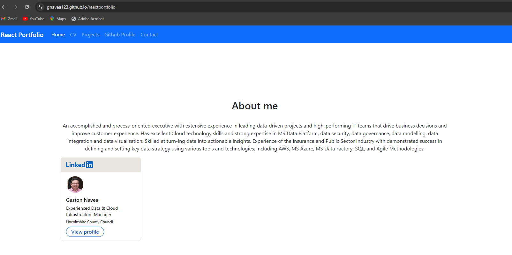
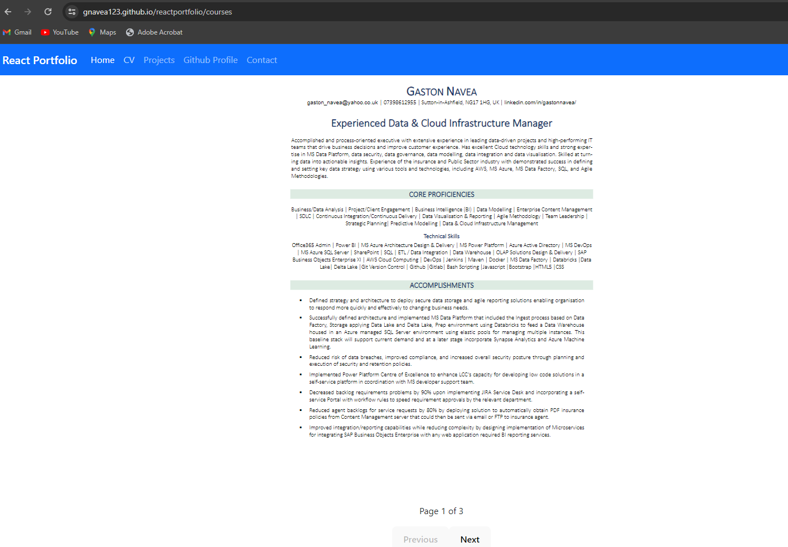
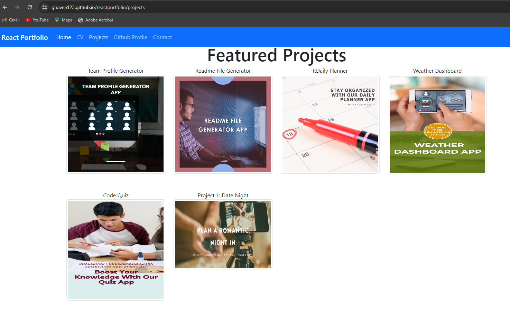
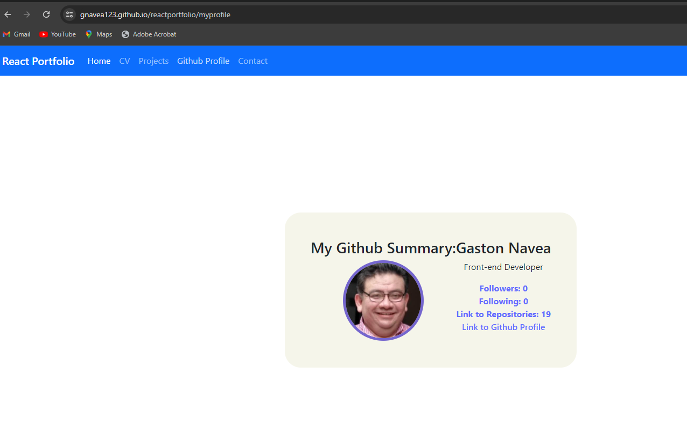
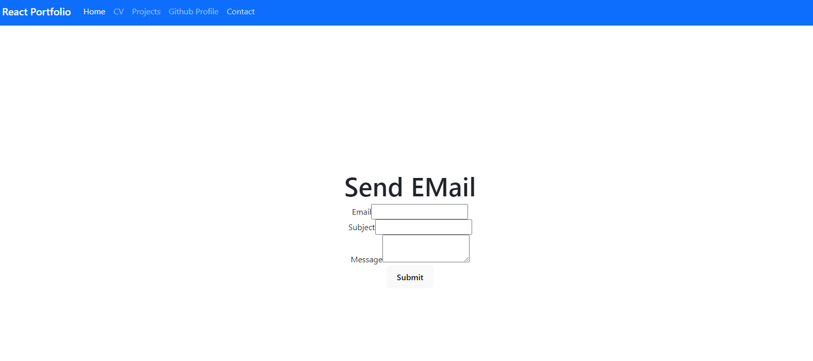

# reactportfolio

The Challenge this week is to use current React knowledge to develop initial Portfolio site


## Table of Contents

- [Installation](#installation)
- [Usage](#usage)
- [Contributing](#contributing)
- [License](#license)

## Installation

These are the steps required to install project:

This Application was created using Vite React with Javascript options. In order to run the application it will be necesary to ensure that the following packages are preintalled before execution:

- node
- [React-pdf](https://www.npmjs.com/package/jest)    (This is used to embed the CV.pdf file within the App)
- [react-router-dom](https://www.npmjs.com/package/react-router-dom)     (This package provides the necessary navigation links within the React App)
- [axios](https://www.npmjs.com/package/react-router-dom)     (This package is used to provide the necessary connection links to Github)

The corresponding packge.json file will indicate the versions required to run the application

## Usage

Instructions and examples for use:

Ths application uses a deploy.yml github pages workflow that is executed eachtime that the code is pushed to gihub.

Deploying to github pages:
Make sure that once you have cloned the source code to your local environment that you do not modify any of the code within the deploy.yml file as it will affect the deployment process for the live application. The use of Node to version 20 has already been modified within the file and should not need any updating until v20 is deprecated. 

In order to run the application locally you will need to navigate to the starter folder App. 
While located at the root of the Starter folder, the application will be invoked by using the following command:

```bash
node run dev
```

## Screen captures of live application

Home Page:

-------------------------------------------
CV Page:

-------------------------------------------
Projects:

-------------------------------------------
GitHub Summary:

-------------------------------------------
Contact:

------------------------------------------


## License

MIT

## Contributing

If you would like to contribute please contact via email as per contact information provided

## Tests


## Questions?

For any questions, please contact me with the information below:

Email: gus.navea@gmail.com